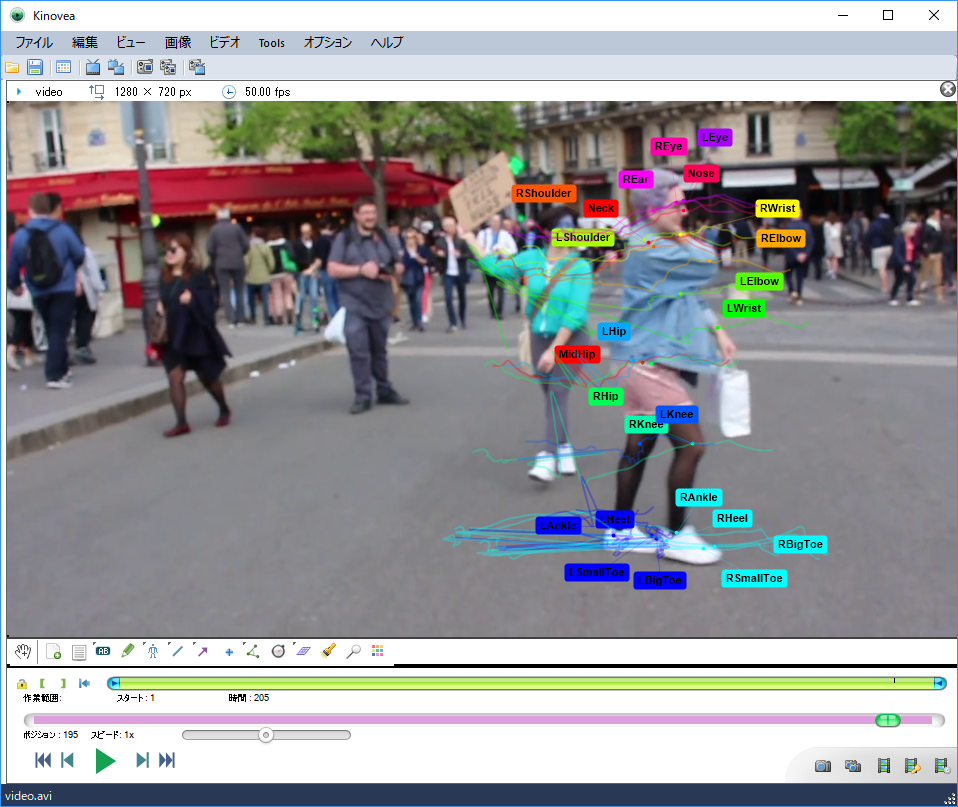
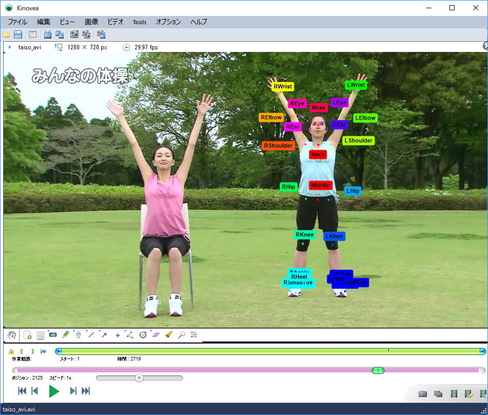

## Background information: 

 "OpenPose" is Real-time multi-person keypoint detection library for body, face, hands, and foot estimation.
 It is open source for research purposes.
 Keypoint JSON file, pose model with 25 joints, can be output in frame-by-frame. 

https://github.com/CMU-Perceptual-Computing-Lab/openpose

Although there is a problem of accuracy, it is still useful if you can read the OpenPose output files with Kinovea.

I made a prototype script to convert from OpenPose JSON files to Kinovea XML file, so I will share it.


# Usage:

1. Making OpenPose Keypoint JSON files

Download OpenPose from https://github.com/CMU-Perceptual-Computing-Lab/openpose/releases. I used Windows CPU version binary.

Run an example command with "-write_json [Output directory]".

``` bin\OpenPoseDemo.exe --video examples\media\video.avi -write_json .\output ```

CPU version is very slow. "GPU" version is faster ten or hundred times.

"examples\media\video.avi" has 205 frames. 205 JSON files will be there.

2. Converst from OpenPose JSON to Kinovea XML

Download conversion program "js2kv.py" from https://github.com/sitony/kinovea.

This program needs "python 3" environment.

Run js2kv.py convert program as follows.

``` python js2kv.py --json media\output\*.json --video media\video.avi --target 640 360 --output video.kva ```

    : js2kv.py [-h] --json files --video file --target axis axis --output file
    Convert from OpenPose JSON to Kinovea KVA (v20181103)
    optional arguments:
        -h, --help          show this help message and exit
      --json files        JSON files (e.g. ./output/*.json)
      --video file        Video file (e.g. ./running.mp4
      --target axis axis  X Y coordinate of target head position (e.g. 320 160)
      --output file       output KVA file (e.g. output.kva)

3. Open by Kinovea

Video file and Output.KVA files must have the same name, and be in the same folder.
 


 
4. Known bug

When opened KVA file from Kinovea together with the MP4 or MKV file, it could not be displayed properly.
AVI file is good. (Kinovea 0.8.27)
